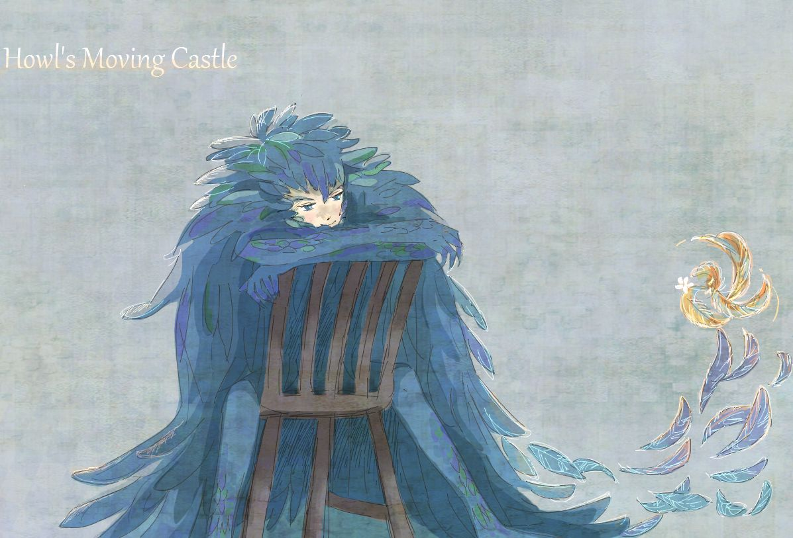

# howl
howl is a tight, classy programming language inspired by Wren and Lua.

# transpiler
howl is not an interpreter or bytecode compiler, but instead offers two transpilers. One that targets Luajit, and one that targets Javascript. Writing an App in howl means you can run it basically everywhere.

# syntax
howl uses a clean, simple syntax to define classes with support for multiple inheritance. It supports a lot of the normal Luajit (Lua 5.1 with extensions) syntax, but extends that with new operators, and removes tables entirely in exchange for the Class object, adding Lists and Maps from Wren.

Here is a small example of howl syntax:

You can see how all this works and it's rules in the docs/ folder.

# why is it called howl?
Well because every time I thought of the name Wren and birds popped into my brain I could never escape the imagery of the Howl's Moving Castle movie. In particular a scene where the titular wizard Howl turns into a huge flying bird and flies off to fight in a war.

Little fanart found on pinterest of Howl's bird form: [[https://uk.pinterest.com/pin/37576978135501059/]]

